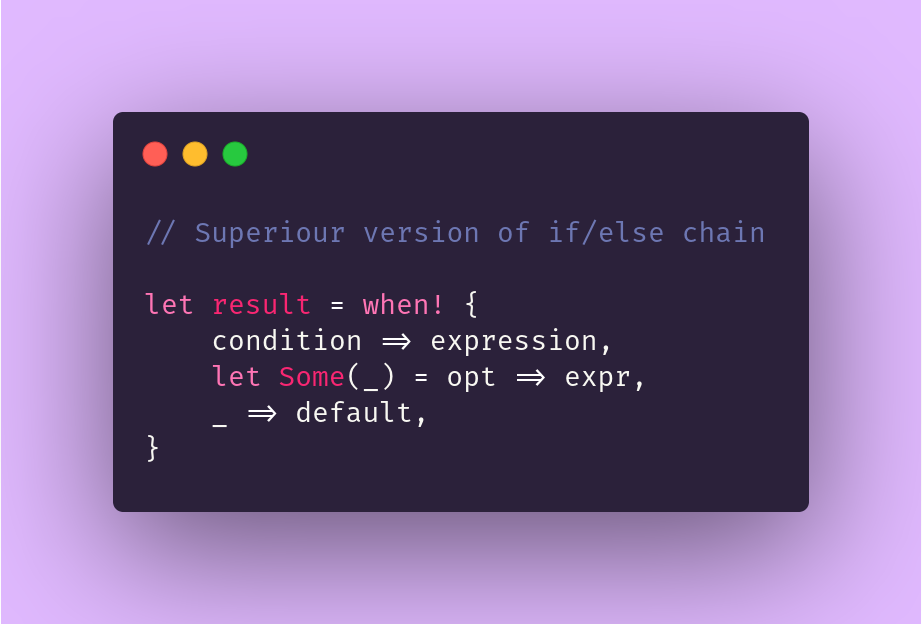

<div align="center">
  
  <h1>kiam</h1>

  <a href="https://github.com/WaffleLapkin/kiam/actions">
    
  </a>
  <a href="https://crates.io/crates/kiam">
    
  </a>    
  <a href="https://docs.rs/kiam">
    
  </a>    
  <a href="https://kiam-rs.netlify.com">
    
  </a>    
  <a href="LICENSE">
    
  </a>

  <i>("kiam" is "when" in Esperanto)</i>
</div>

This crate introduces `when!` macro which provides better syntax for 
`if`/`else if`/`else` chains. The syntax is similar to `match`.

(idea is borrowed from [kotlin][kt-when-expr])

```toml
[dependencies] 
kiam = "0.1"
```

[kt-when-expr]: https://kotlinlang.org/docs/reference/control-flow.html#when-expression

## Usage

Usage is similar to the usage of `match`, but instead of patterns, branches are guarded by boolean expression:

```rust
kiam::when! {
    false => (),
    true => (),
    // ...
}
```

`_` can be used as a default branch (it's also required to use `when!` in expression possition):

```rust
let x = kiam::when! {
    false => 0,
    _ => 1,
};

assert_eq!(x, 1);
```

You can also use `let <pat> =` to match a pattern, but in difference with `match` you'll have to provide an expression for every pattern:

```rust
let a = None;
let b = Some(17);
let fallible = || Err(());

let x = kiam::when! {
    let Some(x) = a => x,
    let Ok(x) = fallible() => x,
    let Some(x) = b => (x as u32) + 1,
    _ => 1,
};

assert_eq!(x, 18);
```

Last notes:
- You can also compare structure litetals without brackets (you can't do thif with `if`/`else if`/`else` chain)
- You can mixup boolean-braches with pattern matching
- Only one branch is executed (not to be confused with `switch` in C-like languages)

```rust
let mut x = 0;

kiam::when! {
    let Ok(_) = Err::<(), _>(()) => x = 1,
    true => x = 2,
    true => x = 3,
    let Some(n) = Some(42) => x = n,
};

assert_eq!(x, 2);
```

```compile_fail
#[derive(PartialEq)]
struct Struct { a: i32 }

// This does not compile because of the ambiguity
if Struct { a: 0 } == Struct { a: 0 } {
    // ...
}
```

```rust
#[derive(PartialEq)]
struct Struct { a: i32 }

kiam::when! {
    // This, on the other hand, compiles fine
    Struct { a: 0 } == Struct { a: 0 } => {
        // ...
    },
}
```
